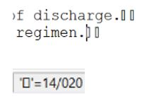
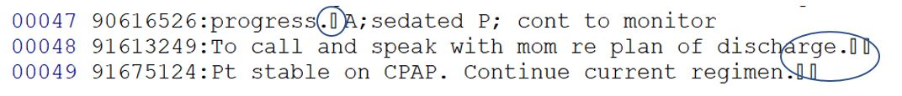
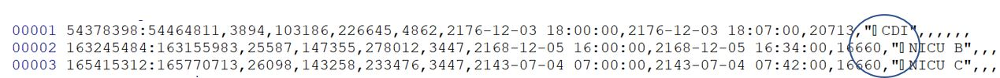

Remove or replace "bad" characters in MIMIC files.

efg | 2018-07-08

## Review MIMIC-III-character-counts.xlsx

This Excel file shows a frequency summary of characters in all MIMIC-III .csv files.

The summary shows two problem files:

**CHARTEVENTS.csv**

**NOTEEVENTS.csv**

## How can one see the “bad” characters in the problem files?

Linux provides much better free tools than Windows for working with problem data.  One way to find problem data records is to use *grep* from Linux to extract the problem lines.

If you’re using Windows without a *grep*, you can install [Rtools for Windows](https://cran.r-project.org/bin/windows/Rtools/).  Verify you have a *grep* in you path:

```
>where grep
c:\Rtools\bin\grep.exe
```

### Write a script to extract the problem lines

A Linux bash script would be beter, but let's use a Windows command ".bat" script:

```
>type FindBadChars.bat
grep -P -n "[\x14]"      ..\..\data\NOTEEVENTS.csv  > hex14-in-NOTEEVENTS.txt
grep -P -n "[\x13-\x14]" ..\..\data\NOTEEVENTS.csv  > hex13and14-in-NOTEEVENTS.txt
grep -P -n "[\x09]"      ..\..\data\CHARTEVENTS.csv > hex09-tabs-in-CHARTEVNTS.txt
```

The first line finds only the lines in NOTEEVENTS.csv with x14 characters.  The next line shows how to get a range with lines with either x13 or x14 characters extracted.  The last line looks for the 3 tabs in the very large file, CHARTEVENTS.csv.

Once we have the problem lines in files how can they be viewed?  

Many tools do not reliably show unusual characters in a file.  Editors like *gedit* or *wordpad* can show “bad” characters in files as rectangles or other symbols, but I don’t know how to interrogate these bad characters to find out exactly what they are.

Some editors have plugins for this, but I use an old reliable editor, [kedit](http://www.kedit.com/), that's provided this capability for years. Position the cursor at a character and see what it is on the status bar at the bottom of the screen.  The graphic below shows the rectangle is a x14 or decimal 20 character.

```{r, echo=FALSE}

```

### Hex 14 characters

Let’s see what we can find in the file `hex14-in-NOTEEVENTS.txt` using *kedit*.  

Let’s look at the last three lines (47-49):

```{r, echo=FALSE}

```

The first column shows line numbers from the editor.  The next column of numbers tells us the line numbers in the original file, NOTEEVENTS.csv in this case.  The line of data follows the colon.

The hex 13 and hex 14 characters don’t seem to follow any particular pattern and they likely can be safely deleted.

Another way to view unprintable characters is to use the Linux *cat* command with the "-v" or "-show-non-printing" option.  While you can see characters this way, the "^" notation does not make sense to me when there are much better ways.

### Tab hex 09 characters

The three tab characters in CHARTEVENTS can be removed without any harm:

```{r, echo=FALSE}

```

## How to remove “bad” characters?

The Linux stream editor, *sed*, is perhaps the easiest approach, but Windows doesn't make that easy.

Rtools is one approach to get a *sed* command on Windows:

```
>where sed
c:\Rtools\bin\sed.exe
```
### sed Examples in Windows command prompt

Let’s use a short text file with three lines as input for the examples that follow.

```
>type test.txt
ab
ac
abc
```

Let’s remove “a”:

```
>type test.txt | sed 's/a//'
b
c
bc
```

Let’s remove “b” and “c”:

```
>type test.txt | sed '{s/b//;s/c//}'
a
a
a
```

Let’s remove “b” and “c” defined with hex constants:

```
>type test.txt | sed '{s/\x62//;s/\x63//}'
a
a
a
```

Let’s remove “b” and “c” defined with hex constants with redirection for input and output:

```
>sed '{s/\x62//;s/\x63//}' < test.txt >fixed.txt
>type fixed.txt
a
a
a
```

## Fixing NOTEEVENTS.csv

A complete analysis of the best fix for this file has not been performed, but let's discuss one possible fix:

* Change each of the 49,415 x09 (tab) characters to a space.
    
* Change each of the 1030 x0D (carriage return) characters to a space.

* Remove each of the 677 x13 characters.

* Remove each of the 49 x14 characters.

* Remove the two x7F (del) characters.


This compound *sed* command makes most of the fixes to the file:

```
>sed '{s/\x13//g; s/\x14//g; s/\x09/ /g; s/\x0D/ /g}' < ..\..\data\NOTEEVENTS.csv > fixedNOTEEVENTS.csv
```

The *charcnt* utility can be used to verify these characters were removed:  `charcnt fixedNOTEEVENTS.csv`
